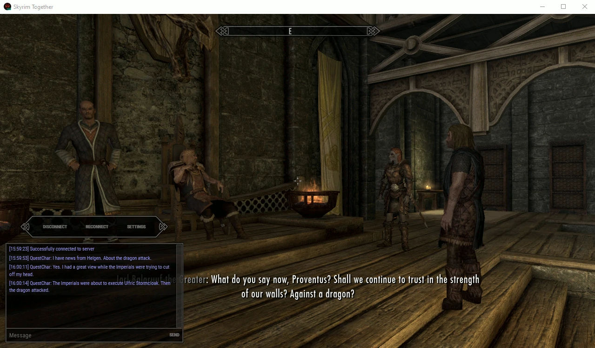
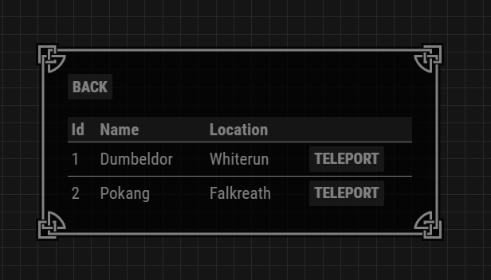
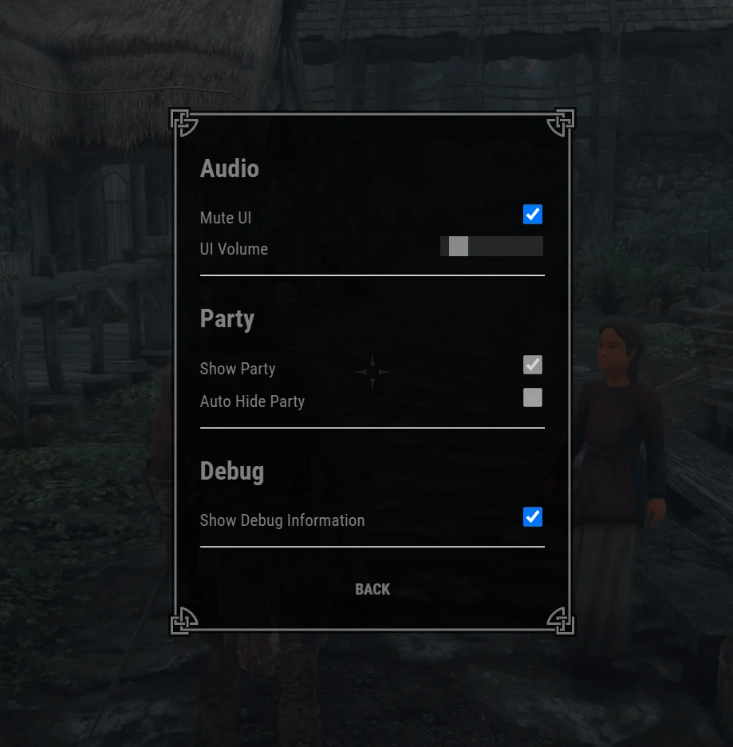
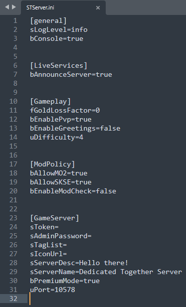

Hey everyone,

This will be our last development progress update before our initial, 1.0 beta release. We will talk about that more later, in a different post. This is the last big feature update. After this, we will focus on adding some miscellaneous features, fixing some critical bugs and getting things ready for our initial beta release.

Best, 
Robbe (cosideci).

## Quest and dialogue sync

The headliner here, as some of you might already know, is quest sync. We have already shown you a video showcasing us playing through a large part of act 1 of the main quest. Since, we have also implemented dialogue sync, including syncing subtitles, and the player's dialogue choices through chat.

As for the gameplay of questing itself: what you've seen in the video is roughly what you can expect on the beta release. You will have to "massage" the quest sync system a bit. You will have start a new game, join up with your friends after leaving Helgen, have one person create a party and be the quest leader, and follow said quest leader. This quest leader is responsible for taking quests, looting quest items, doing quest related puzzles, and talking to quest actors to make story choices. As the quest leader, you should try and enter areas before your friends do, to make sure you are the "host" of that area. It is not recommended to switch quest leaders mid playthrough.

On another note, not all quests will work all that well out of the box on the initial beta release. The sudden possibility of quest sync has opened the mod up to a whole new range of technical problems to solve. We are hoping that people will step up to help out with that when the mod goes open source.

    <iframe style="position: absolute; top: 0; left: 0; width: 100%; height: 100%;" src="https://www.youtube.com/embed/SgGNI7CLIpw" title="YouTube video player" frameborder="0" allow="accelerometer; autoplay; clipboard-write; encrypted-media; gyroscope; picture-in-picture" allowfullscreen></iframe>

## UI

The UI is steadily making progress. We will be reusing the front-end of the old Skyrim Together UI. Dragonisser has been hard at work to improve upon what was already there, like creating a settings menu, fixing the party UI to work with the new party leader system, adding "teleport to player" buttons, a list of players connected to the server, etc. The UI you see here is still a work in progress.

## Player death handling

When a player dies, it goes into a bleedout state. Instead of dying and reloading a save, the player will spawn at the start of the dungeon if it dies in a dungeon. If it dies in a city or in Skyrim, they will simply spawn somewhere nearby, similarly to how it works in GTA Online. On death, you will lose X% of your gold, where X is a configurable setting in the server side settings file. It is set to 0 by default.

## Stability

We have worked hard to make sure that the mod is as stable as possible. While it still crashes every so often, the amount of crashes have reduced significantly compared to 6 months ago when we officially started doing crash fixes. Back then, we often could not play for more than 5 minutes before crashing. Now, we have played for several hours with only 1 to 2 crashes. We have determined that the current level of stability is acceptable for an initial beta release.

## Party XP sync

To simulate vanilla's leveling progression, we have decided to synchronize skill XP gains with your party. Here's how it works. Let's say players 1 and 2 are in a party, and player 1's primary combat skill is one-handed, and player 2's primary combat skill is destruction magic. If player 1 hits a draugrs with a sword and gains 5 XP in the one-handed skill, then player 2 will gain 5 XP in destruction magic. This system only syncs XP gained in combat skills.

We are unsure whether this feature is necessary, or wanted even. This will be a great thing to test on a larger scale when the beta releases.

## Horse sync

Horses are synced fairly well now. Other players can be seen riding horses. They are still some visual bugs present, like horses moving without moving their legs, but we do not expect to fix those before release.

Mounting dragons is also synced, though the player lags behind a bit when riding it, so that looks somewhat funny.

<iframe src='https://gfycat.com/ifr/LightheartedUnselfishGrassspider?autoplay=0&hd=1' frameborder='0' scrolling='no' width='100%' height='100%' style='position:absolute;top:0;left:0;' allowfullscreen></iframe>

## Beast form

The transformations and animations for both the vampire lord and werewolf beast forms are now synced. When a player goes back out of beast form, their forms should be reverted back to their humanoid player character for all players.

<iframe src='https://gfycat.com/ifr/EasygoingFarflungArmyant?autoplay=0&hd=1' frameborder='0' scrolling='no' width='100%' height='100%' style='position:absolute;top:0;left:0;' allowfullscreen></iframe>

## Server settings

We have a implemented a bunch of server settings that will be useful in customizing your server to what you prefer. Here are a few prominent examples:
* Game difficulty
* Pvp
* Gold loss factor on death

## Mod policy

The server now maintains a list of mods that the user should have installed. This prevents desync between players with different mods. The load order is also enforced. If a player is missing certain mods or has too many mods, the server will kick that player and inform them through a message displayed in our UI. This feature is of course optional, but for the most stable experience, we do recommend that you do not disable this feature.

## Dragon sync improvements

Dragons have had some simple (but significant) improvements. They now sync when they travel large distances. You will now see dragons flying off hundreds of meters away with your friends.

## Mod support

We have been hard at work to make sure that Mod Organizer 2 properly loads the mod. SKSE can also be properly loaded again.

## Address library integration

Given the recent "Anniversary Edition" fiasco, we have decided to use the "Address library" mod for Reborn. You will need to install this mod to run Reborn. We will of course have both video and written instructions on how to do that on release.

## General UX improvements

We have made improvements in the general user experience of the mod. For example, when launching the game for the first time, the "Find Skyrim.exe" selection menu has been improved. Another example is versioning. The user is properly notified when they try to connect to a server with an out of date version of the mod.