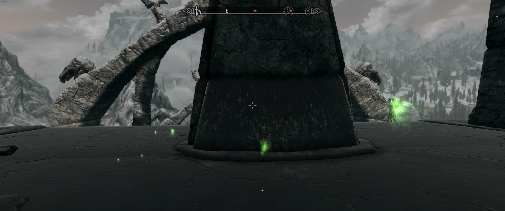

## Update

https://www.reddit.com/r/SkyrimTogether/comments/1acvkej/comment/kjxvsjr/

---

Hey,

so it's been a while, but I'll be dropping another update soon, 1.6. It'll be ready somewhere at the start of January. For anyone wanting to jump into the mod, I'd recommend waiting for 1.6, since it contains some major improvements that drastically improve the gameplay, particularly in combat. Anyway, as a sneak peek, here are the shortened patch notes.

Best, 
Robbe (cosideci).

## Patch notes

* Overhauled combat targeting system
* ESL mod syncing (Anniversary Edition support)
* Calendar sync and calendar progression (dragons can now spawn in the wild!)
* Fixed crashes related to dragons
* Fixed wrong damage calculations
* Waypoint sync (blue markers on map)
* Fixed book reading bug
* Fixed SetTime command crash
* Fixed nightvision effect syncing
* Fixed rare memory leak
* Fixed quest start code
* Added a helper button in the debug UI (F3) that stops all combat in the area (in case a player accidentally agros an entire town for example)
* Added a helper button to reveal other players. Pressing the button (F4) toggles between revealing other players (Similar to Detect Life)

